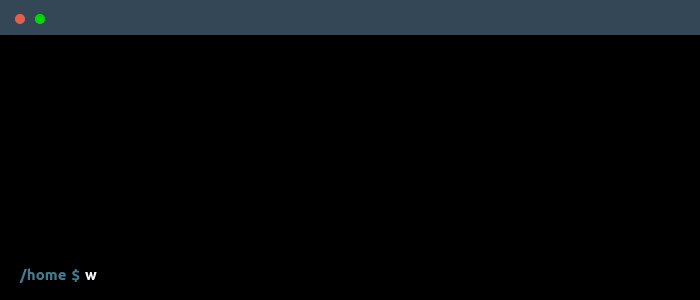

 

<table style="width: 100%;">
  <tr>
    <td align="left" style="width: 48px">
      
    </td>
    <td align="right">
      
    </td>
  </tr>
</table>

  

<h2> Main skills </h2>

<h2> 🤝🏻 Connect with Me </h2>

&nbsp; 
&nbsp; 

 

<!-- Proudly created with GPRM ( https://gprm.itsvg.in ) -->
<!--
**SofieneJOUINI/SofieneJOUINI** is a ✨ _special_ ✨ repository because its `README.md` (this file) appears on your GitHub profile.

Here are some ideas to get you started:

- 🔭 I’m currently working on ...
- 🌱 I’m currently learning ...
- 👯 I’m looking to collaborate on ...
- 🤔 I’m looking for help with ...
- 💬 Ask me about ...
- 📫 How to reach me: ...
- 😄 Pronouns: ...
- ⚡ Fun fact: ...
-->

